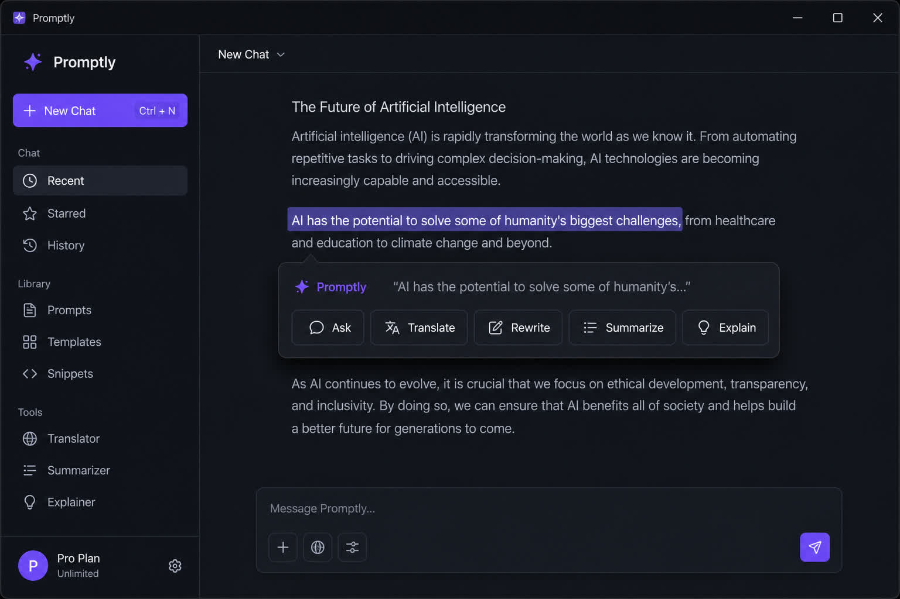

# Promptly

**Select anything. Ask any AI.**

[English](README.md) · [中文](README.zh-CN.md)

产品站：https://onesun2012.github.io/promptly/

下载：https://github.com/onesun2012/promptly/releases/latest

Windows Local-first BYOK 划词 AI。无账号、无中继、零内容遥测。

## 功能
- 划词三态工具条
- 悬浮球
- BYOK（OpenAI 兼容 / Anthropic / Gemini）
- 聊天粘贴截图视觉识别
- 本地 SQLite + DPAPI
- 10 语种

## 上手
1. Releases 安装
2. 设置 → Provider lab → 测试 → 保存
3. 划词 → 翻译

隐私：PRIVACY.md · 规格：SPEC.md · License：MIT
